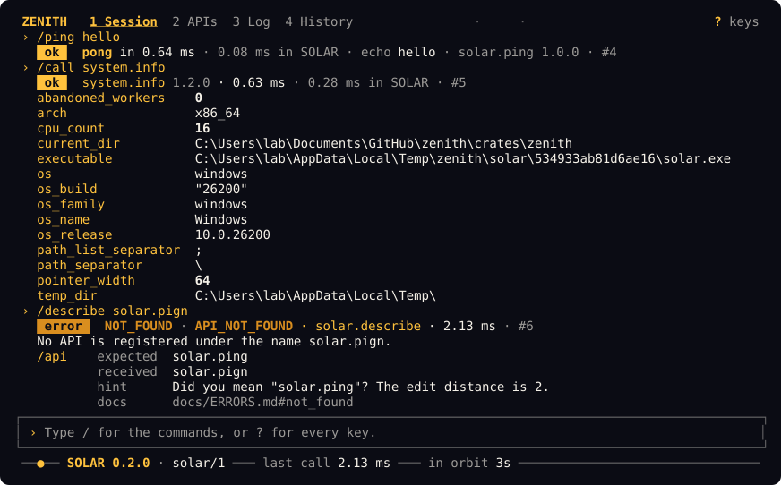
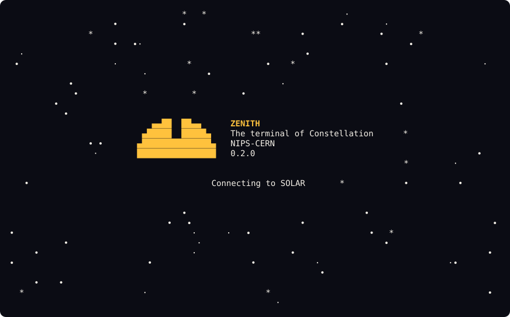
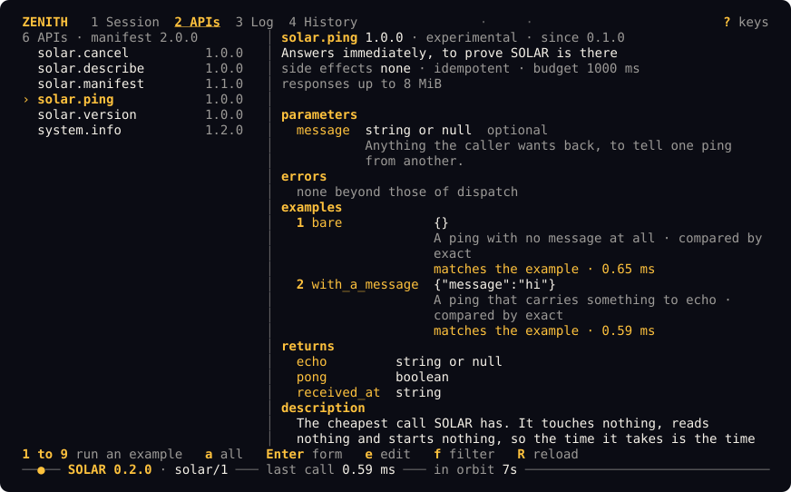
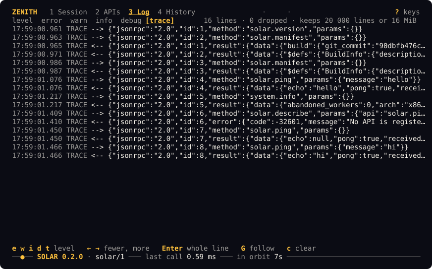
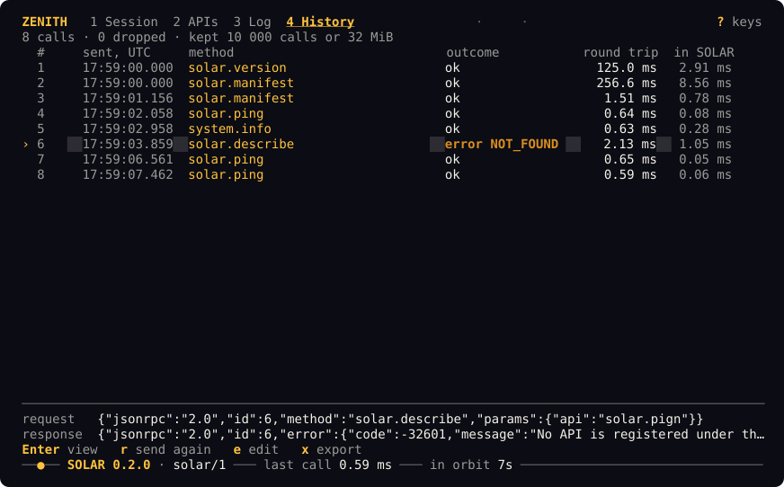
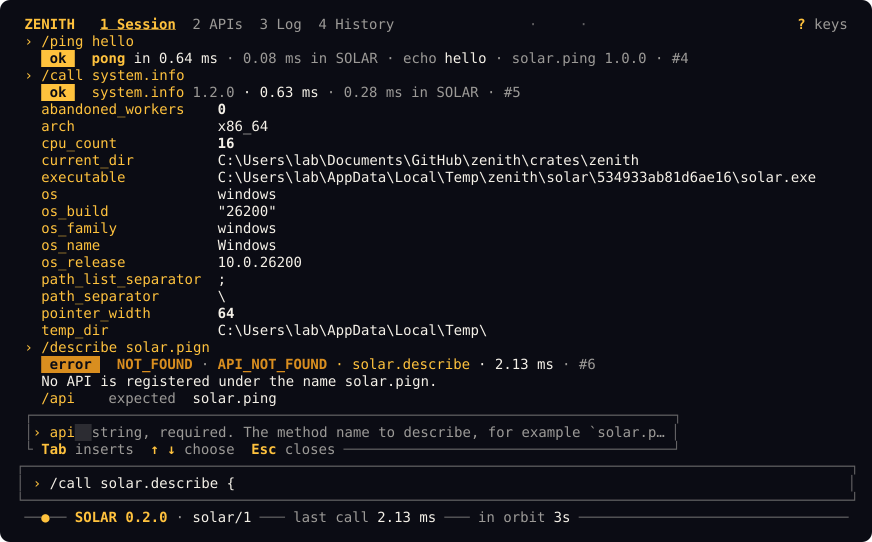
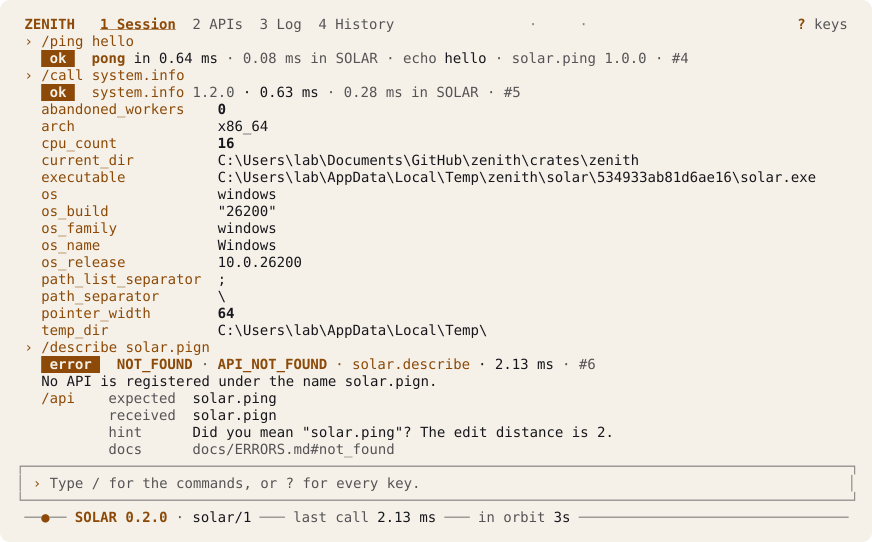

# ZENITH

**The terminal of Constellation, from NIPS-CERN.** A full-screen application in which a
person talks to SOLAR, the API at the centre of Constellation, with tabs, commands and
completion, in any terminal on Windows, macOS and Linux.



Constellation is everything around the SAPHO processor, and SOLAR is its single boundary:
every interface talks to SOLAR and to nothing else. ZENITH is one of those interfaces, the
box drawn as SOLAR.CLI on the architecture board, named after the highest point of the
sky. It starts `solar serve --stdio` as a child process and speaks JSON-RPC 2.0 to it, one
message per line, exactly as any other interface would. It links nothing of SOLAR, and
everything it shows about the APIs comes from SOLAR at run time: a new SOLAR API appears
in ZENITH with no change to ZENITH.

SOLAR is tested by hand through ZENITH, on Windows, on Linux and on the laboratory Mac.
[`docs/TESTING_BY_HAND.md`](docs/TESTING_BY_HAND.md) is the guide for that.

## Try it

You need Rust, which [rustup](https://rustup.rs) installs, and SOLAR, from
[nipscernlab/solar](https://github.com/nipscernlab/solar). Build both:

```bash
git clone https://github.com/nipscernlab/solar
git clone https://github.com/nipscernlab/zenith
cd solar && cargo build --release --locked -p solar-cli && cd ..
cd zenith && cargo build --release --locked -p zenith
```

Then start ZENITH, telling it where SOLAR is, or putting SOLAR's `target/release` on the
`PATH` so that it finds it by itself:

```bash
./target/release/zenith --solar ../solar/target/release/solar
```

The opening, a starfield with the SOLAR mark, lasts as long as the connection takes,
about twenty milliseconds on the machine it was written on, and any key skips it. Type `/` for the commands and `?` for
every key.



## What there is

**Session.** A command line with history and completion, and every response laid out for
a person. The full envelope, exactly as it crossed the pipe, is one key away: `Ctrl+O`.
Every response is checked against SOLAR's contract as it arrives, and a response that
breaks it says which section it breaks.

**APIs.** The catalogue from the manifest: for each API, its summary, parameters, errors,
side effects, examples and what it returns. Each example runs with one key, `1` to `9`,
and its answer is compared with what the example declares. `Enter` opens a form built
from the API's schema.



**Log.** SOLAR's standard error, at the level chosen with `e`, `w`, `i`, `d` and `t`.



**History.** Every request and response with its timing, exportable with `x` or
`/export`.



Parameters are checked against the API's schema before they are sent, and the part of the
line that is wrong is underlined. `Tab` completes the commands, the API names, and the
parameter names and values the schema allows at the cursor:



## Commands

| Command | What it does |
| ------- | ------------ |
| `/list` | Every API SOLAR answers to |
| `/describe <api>` | One API: parameters, errors, side effects, examples |
| `/call <api> [json]` | Any call, with its parameters checked before it is sent |
| `/ping [message]` | The round trip, and SOLAR's own time |
| `/version` | The versions of SOLAR, its protocol, its manifest, and its build |
| `/theme [name]` | `night`, `light` or `high-contrast` |
| `/help [command]` | The commands, or one of them |
| `/quit` | Leave |
| `/raw <line>` | Send a line exactly as typed: a batch, a broken envelope |
| `/reconnect` | Restart SOLAR, and pick up a new build of it |
| `/clear` | Empty the transcript; the History keeps everything |
| `/export [path]` | Write the History to a file |
| `/report [path]` | Write one file with everything a bug report needs |

## Keys

Every action has a plain key or a `Ctrl` key, so everything works in macOS Terminal,
where Option is not Alt, and in the classic Windows console. `?` lists every key.

| Key | Action |
| --- | ------ |
| `Tab`, `Shift+Tab` | The next and previous tab; on the command line with text, completion |
| `Ctrl+O` | The whole envelope of the latest call |
| `Ctrl+C` | Cancel the call in flight when SOLAR offers `solar.cancel`; pressed again, quit |
| `Ctrl+R` | Restart SOLAR |
| `Ctrl+L` | Draw the screen again |
| `?` | Every key, by where it works |

## When SOLAR fails

If `solar` is not on the `PATH`, cannot start, exits, speaks another protocol, or writes
something that is not the contract, ZENITH says what happened in one sentence and what to
do in another, quotes SOLAR's last lines of standard error, and offers to start it again.
SOLAR is found by `--solar <path>`, then the variable `ZENITH_SOLAR`, then the `PATH`.

On Windows, ZENITH never runs `solar.exe` where it was built. It copies it to
`%TEMP%\zenith\solar\<hash>\` and runs the copy, so that SOLAR's build can always replace
its own binary while ZENITH is open.

## Colour and characters

The night theme is the default, with the colours of SOLAR's mark; there is a light one and
a high-contrast one. The contrast of every colour is computed by a test against WCAG 2.2,
and colour never carries meaning alone.



| Flag | Variable | What it does |
| ---- | -------- | ------------ |
| `--theme <name>` | `ZENITH_THEME` | `night`, `light` or `high-contrast` |
| `--color <depth>` | `ZENITH_COLOR` | `truecolor`, `256`, `16` or `none`; guessed from the terminal when not given |
| | `NO_COLOR` | No colour at all ([no-color.org](https://no-color.org)); `--color` is the one thing that overrides it |
| `--ascii` | `ZENITH_ASCII` | 7-bit ASCII only, for terminals without Unicode |
| `--solar-log <level>` | | The level SOLAR is started at; the Log tab filters below it |

ZENITH works at 80 × 24 and above, handles resizing, and gives the terminal back as it
found it, even after a panic.

## Another program called zenith

A system monitor written in Rust installs a binary of the same name. `zenith --version`
says which one runs:

```text
ZENITH 0.1.0, the terminal of Constellation, NIPS-CERN
```

## Measured

On the machine it was written on, a Windows 11 laptop with an Intel Core i7-13620H, against
SOLAR 0.2.0. `cargo xtask perf` and `cargo xtask soak` measure the real binary in a
pseudo-terminal, and `STATUS.md` has every figure with how it was taken.

| What | Figure |
| ---- | ------ |
| Start to connected, drawn | 20 to 25 ms, the median of ten starts, in four runs; 37 to 51 ms until the terminal shows it |
| A key to its redraw | 0.3 to 0.5 ms, the median of two hundred keys, in four runs; at most 1.1 ms at the 99th percentile |
| Idle | No processor time that can be measured in a minute, one wake-up, about 8.5 MiB resident |
| Memory after 100 000 calls | 28.6 MiB, level from 20 000 calls on, when every ring buffer is full |

## How it is built and checked

```bash
cargo xtask ci
```

That one command runs what CI runs, in the same order and with the same flags:
formatting, TOML formatting, spelling, lints with `-D warnings`, the tests with
`cargo-nextest`, the doctests, the documentation, the check that every commit that changes
code adds to `CHANGELOG.md`, the check that the pictures of this README are the snapshots
they are drawn from, the table of the guide for testing by hand typed into ZENITH in a
pseudo-terminal, the supply chain with `cargo-deny`, and the coverage against its floor.
CI runs it on Linux, Windows and macOS, against SOLAR built from its main branch.

The pictures above are drawn from a session recorded against SOLAR 0.2.0, replayed through
ZENITH's own drawing code and snapshotted; `cargo xtask screenshots` draws them, and CI
fails when they are not the snapshots.

## The documents

| Document | What it is for |
| -------- | -------------- |
| [`AGENTS.md`](AGENTS.md) | Where to start, for a person or a coding agent |
| [`docs/DESIGN.md`](docs/DESIGN.md) | What ZENITH shows and does, and why |
| [`docs/ADDING_A_FEATURE.md`](docs/ADDING_A_FEATURE.md) | The one path for adding a tab, a command or a view |
| [`docs/TESTING_BY_HAND.md`](docs/TESTING_BY_HAND.md) | Testing SOLAR through ZENITH, for someone who has never used Rust |
| [`docs/STYLE.md`](docs/STYLE.md) | How the code, the messages and the commits are written |
| [`docs/adr/`](docs/adr/) | The decisions that are settled |
| [`docs/OPEN_QUESTIONS.md`](docs/OPEN_QUESTIONS.md) | The decisions taken without asking, and what ZENITH needed from SOLAR and did not find |
| [`CONTRIBUTING.md`](CONTRIBUTING.md) | Setting up, the tools, the rules about dependencies |
| [`STATUS.md`](STATUS.md) | What is ready, what was measured, what is left |
| [`CHANGELOG.md`](CHANGELOG.md) | What changed |

## Who wrote this

**NIPS-CERN**, the Núcleo de Instrumentação e Processamento de Sinais, at the Faculdade de
Engenharia of the Universidade Federal de Juiz de Fora in Brazil, and at CERN in
Switzerland. The group is part of the ATLAS collaboration and works on TileCal, the tile
calorimeter.

- **Chrysthofer Arthur Amaro Afonso**, technical coordinator of NIPS-CERN, architect of
  SOLAR, ZENITH and Constellation. <chrysthofer.afonso@cern.ch>
- **Prof. Luciano Manhães de Andrade Filho**, head of the group and ATLAS Team Leader at
  UFJF.

[nipscern.com](https://nipscern.com) · [github.com/nipscernlab](https://github.com/nipscernlab)
· [gitlab.com/nips-cern](https://gitlab.com/nips-cern)

## Licence

The NIPS-CERN Licence, version 1.1. The [LICENSE](LICENSE) file is the base licence of the
laboratory, copied without a character changed.
